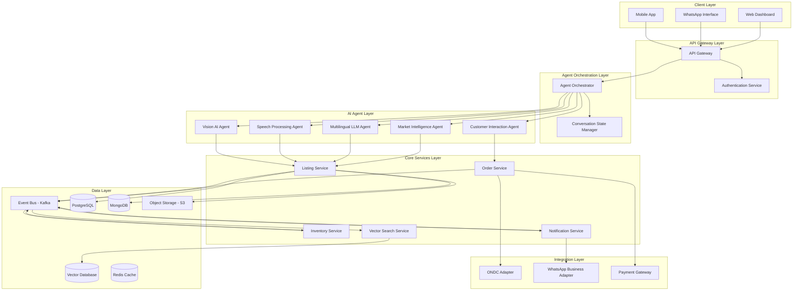
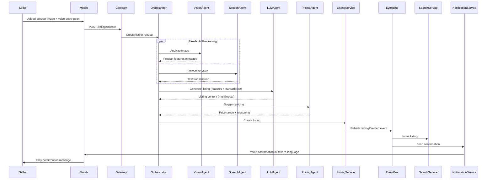

# Design Document: VyapaarSetu AI

## Overview

VyapaarSetu AI is an event-driven, multi-agent AI system designed to democratize digital commerce for millions of Indian sellers. The system employs a microservices architecture with specialized AI agents orchestrated to handle voice-based product listing, multilingual customer interactions, and autonomous commerce operations.

### Key Design Principles

1. **Voice-First Interface**: Minimize typing by prioritizing voice and image inputs
2. **Offline-First Architecture**: Queue operations locally and sync when connected
3. **Low-Bandwidth Optimization**: Compress data aggressively and use progressive loading
4. **Multi-Agent Coordination**: Specialized AI agents working together through orchestration
5. **Event-Driven Communication**: Asynchronous, scalable microservices using event sourcing
6. **Mobile-Native Experience**: Optimized for small screens and touch interactions

### Technology Stack

- **Vision AI**: Pre-trained models (ResNet, EfficientNet) fine-tuned on Indian products
- **Speech-to-Text**: Whisper or IndicWav2Vec for Indian languages
- **Multilingual LLM**: GPT-4 or Llama with Indian language fine-tuning
- **Vector Database**: Pinecone or Weaviate for semantic search
- **Event Bus**: Apache Kafka or AWS EventBridge
- **Message Queue**: RabbitMQ or AWS SQS for async processing
- **Database**: PostgreSQL for transactional data, MongoDB for flexible schemas
- **Cache**: Redis for session state and frequently accessed data
- **Mobile Framework**: React Native or Flutter for cross-platform mobile app
- **WhatsApp Integration**: WhatsApp Business API

## Architecture

### High-Level Architecture



### Event-Driven Flow Example: Product Listing Creation



## Components and Interfaces

### 1. Agent Orchestrator

**Responsibility**: Coordinates multiple AI agents to fulfill complex seller and customer requests.

**Key Operations**:
- `orchestrateListingCreation(images, voiceInput, sellerId)`: Coordinates vision, speech, LLM, and pricing agents
- `orchestrateCustomerQuery(query, conversationContext)`: Routes customer inquiries to appropriate agents
- `handleAgentFailure(agentId, task, error)`: Implements retry logic and fallbacks
- `maintainConversationState(sessionId, agentOutputs)`: Tracks multi-turn conversations

**Interface**:
```typescript
interface AgentOrchestrator {
  orchestrateListingCreation(
    images: ImageFile[],
    voiceInput: AudioFile,
    sellerId: string,
    language: BharatLanguage
  ): Promise<ListingDraft>;
  
  orchestrateCustomerQuery(
    query: string,
    conversationContext: ConversationState,
    language: BharatLanguage
  ): Promise<AgentResponse>;
  
  handleAgentFailure(
    agentId: string,
    task: AgentTask,
    error: Error
  ): Promise<AgentTask>;
}
```

### 2. Vision AI Agent

**Responsibility**: Analyzes product images to extract category, attributes, and visual features.

**Key Operations**:
- `analyzeProductImage(image)`: Returns product category, attributes, and confidence scores
- `extractTextFromImage(image)`: OCR for labels and packaging text
- `detectImageQuality(image)`: Assesses if image is suitable for listing
- `generateImageEmbedding(image)`: Creates vector representation for search

**Interface**:
```typescript
interface VisionAIAgent {
  analyzeProductImage(image: ImageFile): Promise<ProductAnalysis>;
  extractTextFromImage(image: ImageFile): Promise<ExtractedText>;
  detectImageQuality(image: ImageFile): Promise<QualityScore>;
  generateImageEmbedding(image: ImageFile): Promise<Vector>;
}

interface ProductAnalysis {
  category: string;
  subcategory: string;
  attributes: Map<string, string>; // e.g., "color" -> "red"
  confidence: number;
  suggestedTags: string[];
}
```

### 3. Speech Processing Agent

**Responsibility**: Converts voice input to text with dialect normalization.

**Key Operations**:
- `transcribeVoice(audio, language)`: Converts speech to text
- `normalizeDialect(text, dialect, targetLanguage)`: Standardizes regional variations
- `detectLanguage(audio)`: Identifies spoken language
- `filterNoise(audio)`: Removes background noise

**Interface**:
```typescript
interface SpeechProcessingAgent {
  transcribeVoice(
    audio: AudioFile,
    language: BharatLanguage
  ): Promise<Transcription>;
  
  normalizeDialect(
    text: string,
    dialect: Dialect,
    targetLanguage: BharatLanguage
  ): Promise<string>;
  
  detectLanguage(audio: AudioFile): Promise<BharatLanguage>;
}

interface Transcription {
  text: string;
  confidence: number;
  detectedDialect: Dialect;
  timestamps: TimeSegment[];
}
```

### 4. Multilingual LLM Agent

**Responsibility**: Generates listing content, translates between languages, and handles natural language understanding.

**Key Operations**:
- `generateListing(productInfo, voiceDescription, language)`: Creates complete listing
- `translateContent(text, sourceLanguage, targetLanguage)`: Translates between Bharat languages
- `extractIntent(userMessage, context)`: Understands user intentions
- `generateResponse(intent, context, language)`: Creates contextual responses

**Interface**:
```typescript
interface MultilingualLLMAgent {
  generateListing(
    productInfo: ProductAnalysis,
    voiceDescription: string,
    language: BharatLanguage
  ): Promise<ListingContent>;
  
  translateContent(
    text: string,
    sourceLanguage: BharatLanguage,
    targetLanguage: BharatLanguage
  ): Promise<string>;
  
  extractIntent(
    userMessage: string,
    context: ConversationState
  ): Promise<Intent>;
}

interface ListingContent {
  title: string;
  description: string;
  keyFeatures: string[];
  tags: string[];
  translations: Map<BharatLanguage, ListingContent>;
}
```

### 5. Customer Interaction Agent

**Responsibility**: Autonomously handles customer inquiries and guides purchase process.

**Key Operations**:
- `handleCustomerQuery(query, productContext, conversationHistory)`: Responds to customer questions
- `escalateToSeller(query, reason)`: Notifies seller when human input needed
- `guidePurchase(customer, product)`: Walks customer through checkout
- `maintainContext(conversationId, messages)`: Tracks conversation state

**Interface**:
```typescript
interface CustomerInteractionAgent {
  handleCustomerQuery(
    query: string,
    productContext: Product,
    conversationHistory: Message[],
    language: BharatLanguage
  ): Promise<AgentResponse>;
  
  escalateToSeller(
    query: string,
    reason: EscalationReason,
    sellerId: string
  ): Promise<void>;
  
  guidePurchase(
    customerId: string,
    productId: string,
    language: BharatLanguage
  ): Promise<PurchaseGuidance>;
}

interface AgentResponse {
  message: string;
  requiresSellerInput: boolean;
  suggestedActions: Action[];
  confidence: number;
}
```

### 6. Market Intelligence Agent

**Responsibility**: Analyzes market data to provide pricing suggestions and demand insights.

**Key Operations**:
- `suggestPricing(product, sellerLocation)`: Recommends competitive price range
- `analyzeDemand(category, location, timeframe)`: Provides demand trends
- `detectPriceAnomalies(sellerId, proposedPrice, marketData)`: Warns about unusual pricing
- `explainPricing(priceRange, language)`: Generates human-readable pricing rationale

**Interface**:
```typescript
interface MarketIntelligenceAgent {
  suggestPricing(
    product: ProductAnalysis,
    sellerLocation: Location
  ): Promise<PricingSuggestion>;
  
  analyzeDemand(
    category: string,
    location: Location,
    timeframe: TimeRange
  ): Promise<DemandAnalysis>;
  
  explainPricing(
    priceRange: PriceRange,
    language: BharatLanguage
  ): Promise<string>;
}

interface PricingSuggestion {
  recommendedPrice: number;
  priceRange: { min: number; max: number };
  reasoning: string;
  competitorPrices: number[];
  confidence: number;
}
```

### 7. Listing Service

**Responsibility**: Manages product listings lifecycle and persistence.

**Key Operations**:
- `createListing(listingData, sellerId)`: Creates new product listing
- `updateListing(listingId, updates)`: Modifies existing listing
- `publishListing(listingId, marketplaces)`: Makes listing live on platforms
- `generateONDCCatalog(listingId)`: Creates ONDC-compliant catalog entry

**Interface**:
```typescript
interface ListingService {
  createListing(
    listingData: ListingDraft,
    sellerId: string
  ): Promise<Listing>;
  
  updateListing(
    listingId: string,
    updates: Partial<ListingDraft>
  ): Promise<Listing>;
  
  publishListing(
    listingId: string,
    marketplaces: Marketplace[]
  ): Promise<PublishResult>;
  
  generateONDCCatalog(listingId: string): Promise<ONDCCatalogEntry>;
}
```

### 8. Vector Search Service

**Responsibility**: Provides semantic search across product listings.

**Key Operations**:
- `indexListing(listing, embeddings)`: Adds listing to vector database
- `searchByText(query, language, filters)`: Finds products by natural language
- `searchByImage(image)`: Finds visually similar products
- `getSimilarProducts(productId, limit)`: Recommends related items

**Interface**:
```typescript
interface VectorSearchService {
  indexListing(
    listing: Listing,
    textEmbedding: Vector,
    imageEmbedding: Vector
  ): Promise<void>;
  
  searchByText(
    query: string,
    language: BharatLanguage,
    filters: SearchFilters
  ): Promise<SearchResult[]>;
  
  searchByImage(image: ImageFile): Promise<SearchResult[]>;
}

interface SearchResult {
  productId: string;
  similarity: number;
  listing: Listing;
}
```

### 9. Notification Service

**Responsibility**: Sends notifications via WhatsApp, SMS, and push notifications.

**Key Operations**:
- `sendVoiceMessage(sellerId, message, language)`: Sends voice notification via WhatsApp
- `sendOrderNotification(sellerId, order)`: Notifies seller of new orders
- `sendTextNotification(userId, message, channel)`: Sends text-based alerts
- `queueNotification(notification, priority)`: Queues notifications for delivery

**Interface**:
```typescript
interface NotificationService {
  sendVoiceMessage(
    sellerId: string,
    message: string,
    language: BharatLanguage
  ): Promise<void>;
  
  sendOrderNotification(
    sellerId: string,
    order: Order
  ): Promise<void>;
  
  queueNotification(
    notification: Notification,
    priority: Priority
  ): Promise<void>;
}
```

### 10. Offline Sync Manager

**Responsibility**: Manages offline data storage and synchronization.

**Key Operations**:
- `queueOfflineAction(action, data)`: Stores action for later sync
- `syncWhenOnline()`: Uploads queued actions when connectivity restored
- `resolveConflicts(localData, serverData)`: Handles sync conflicts
- `prioritizeSync(actions)`: Orders sync operations by importance

**Interface**:
```typescript
interface OfflineSyncManager {
  queueOfflineAction(
    action: OfflineAction,
    data: any
  ): Promise<void>;
  
  syncWhenOnline(): Promise<SyncResult>;
  
  resolveConflicts(
    localData: any,
    serverData: any
  ): Promise<any>;
  
  prioritizeSync(actions: OfflineAction[]): OfflineAction[];
}

interface OfflineAction {
  id: string;
  type: ActionType;
  data: any;
  timestamp: Date;
  priority: Priority;
  retryCount: number;
}
```

## Data Models

### Seller

```typescript
interface Seller {
  id: string;
  name: string;
  phoneNumber: string;
  whatsappNumber: string;
  preferredLanguage: BharatLanguage;
  location: Location;
  businessType: BusinessType;
  verificationStatus: VerificationStatus;
  createdAt: Date;
  lastActiveAt: Date;
}

enum BusinessType {
  RURAL_ENTREPRENEUR = "rural_entrepreneur",
  SMALL_RETAILER = "small_retailer",
  HOME_BASED = "home_based",
  LOCAL_MANUFACTURER = "local_manufacturer",
  WOMEN_ENTREPRENEUR = "women_entrepreneur"
}
```

### Product Listing

```typescript
interface Listing {
  id: string;
  sellerId: string;
  title: string;
  description: string;
  category: string;
  subcategory: string;
  attributes: Map<string, string>;
  price: number;
  currency: string;
  images: ImageMetadata[];
  tags: string[];
  translations: Map<BharatLanguage, ListingTranslation>;
  status: ListingStatus;
  marketplaces: Marketplace[];
  ondcCatalogId?: string;
  createdAt: Date;
  updatedAt: Date;
  embeddings: {
    text: Vector;
    image: Vector;
  };
}

interface ListingTranslation {
  title: string;
  description: string;
  keyFeatures: string[];
}

enum ListingStatus {
  DRAFT = "draft",
  PENDING_REVIEW = "pending_review",
  ACTIVE = "active",
  INACTIVE = "inactive",
  SOLD_OUT = "sold_out"
}
```

### Conversation State

```typescript
interface ConversationState {
  sessionId: string;
  userId: string;
  userType: "seller" | "customer";
  language: BharatLanguage;
  context: ConversationContext;
  messages: Message[];
  currentIntent: Intent;
  agentResponsible: string;
  createdAt: Date;
  lastUpdatedAt: Date;
}

interface ConversationContext {
  productId?: string;
  orderId?: string;
  listingDraft?: ListingDraft;
  previousIntents: Intent[];
  userPreferences: Map<string, any>;
}

interface Message {
  id: string;
  sender: "user" | "agent" | "system";
  content: string;
  contentType: "text" | "voice" | "image";
  timestamp: Date;
  metadata: Map<string, any>;
}
```

### Event Models

```typescript
interface ListingCreatedEvent {
  eventId: string;
  eventType: "listing.created";
  timestamp: Date;
  sellerId: string;
  listingId: string;
  listing: Listing;
  metadata: {
    source: "mobile" | "whatsapp" | "web";
    processingTime: number;
  };
}

interface OrderReceivedEvent {
  eventId: string;
  eventType: "order.received";
  timestamp: Date;
  orderId: string;
  sellerId: string;
  customerId: string;
  productId: string;
  amount: number;
  source: "ondc" | "whatsapp" | "direct";
}

interface CustomerInquiryEvent {
  eventId: string;
  eventType: "customer.inquiry";
  timestamp: Date;
  customerId: string;
  productId: string;
  query: string;
  language: BharatLanguage;
  requiresEscalation: boolean;
}
```

### ONDC Catalog Entry

```typescript
interface ONDCCatalogEntry {
  id: string;
  providerId: string;
  providerName: string;
  items: ONDCItem[];
  fulfillments: Fulfillment[];
  createdAt: Date;
  updatedAt: Date;
}

interface ONDCItem {
  id: string;
  descriptor: {
    name: string;
    code: string;
    symbol: string;
    shortDesc: string;
    longDesc: string;
    images: string[];
  };
  price: {
    currency: string;
    value: string;
    maximumValue: string;
  };
  categoryId: string;
  fulfillmentId: string;
  locationId: string;
  tags: ONDCTag[];
}
```

## Correctness Properties

*A property is a characteristic or behavior that should hold true across all valid executions of a system—essentially, a formal statement about what the system should do. Properties serve as the bridge between human-readable specifications and machine-verifiable correctness guarantees.*


### Property Reflection

After analyzing all acceptance criteria, I've identified the following consolidations to eliminate redundancy:

**Consolidations:**
- Properties 6.2, 6.5, 7.5, 8.5 all test voice message notifications in seller's language - can be combined into one comprehensive notification property
- Properties 8.1, 8.2, 8.3 all test offline functionality - can be combined into one offline round-trip property
- Properties 3.1 and 3.2 both test listing generation - can be combined to test complete bilingual listing generation
- Properties 11.2 and 11.4 both test UI element sizing - can be combined into one UI standards property
- Properties 14.1 and 14.2 both test event publishing - can be combined into one event sourcing property

**Unique Properties Retained:**
- Image processing properties (1.1-1.5) each test distinct aspects: extraction, combination, quality handling, OCR, compression
- Customer agent properties (5.2-5.5) each test different conversation capabilities
- ONDC properties (7.1, 7.2, 7.4) each test different compliance aspects
- Security properties (15.1-15.5) each test different security controls

### Correctness Properties

Property 1: Image Analysis Completeness
*For any* product image uploaded by a seller, the Vision_AI should extract and return a ProductAnalysis object containing category, attributes, and visual features within 5 seconds
**Validates: Requirements 1.1**

Property 2: Multi-Image Information Aggregation
*For any* set of multiple images of the same product, the combined ProductAnalysis should contain at least as much information as the analysis from any single image in the set
**Validates: Requirements 1.2**

Property 3: Low Quality Image Handling
*For any* image with quality score below threshold, the system should request additional images or voice clarification rather than creating a listing with incomplete data
**Validates: Requirements 1.3**

Property 4: OCR Text Incorporation
*For any* product image containing visible text, the extracted text should appear in the generated product information
**Validates: Requirements 1.4**

Property 5: Compression Preserves Recognition
*For any* product image, compressing it for low bandwidth transmission should maintain Vision_AI recognition accuracy above 85% compared to the original image
**Validates: Requirements 1.5**

Property 6: Language Support Coverage
*For any* voice input in Hindi, Tamil, Telugu, Bengali, Marathi, Gujarati, Kannada, Malayalam, or Punjabi, the Speech_Engine should successfully transcribe it without throwing language-not-supported errors
**Validates: Requirements 2.4**

Property 7: Ambiguous Input Clarification
*For any* voice input that the Speech_Engine marks as low confidence (below 70%), the system should request clarification rather than proceeding with uncertain data
**Validates: Requirements 2.5**

Property 8: Offline Voice Queueing Round-Trip
*For any* voice input recorded while offline, when connectivity is restored, the input should be processed and the resulting transcription should be available to the seller
**Validates: Requirements 2.6**

Property 9: Bilingual Listing Generation
*For any* product image and voice description pair, the generated listing should contain complete title, description, category, and attributes in both the seller's local language and English within 10 seconds
**Validates: Requirements 3.1, 3.2**

Property 10: Marketplace Format Compliance
*For any* generated listing, the title length, description structure, and keyword placement should conform to marketplace-specific formatting requirements (e.g., title ≤ 200 chars, description has bullet points)
**Validates: Requirements 3.3**

Property 11: Voice-Based Listing Edits
*For any* generated listing and voice edit command, applying the edit should modify the listing to reflect the requested change
**Validates: Requirements 3.4**

Property 12: Pricing Suggestion Generation
*For any* newly created listing, the Market_Intelligence_Engine should return a price range suggestion with min, max, and recommended values within 15 seconds
**Validates: Requirements 4.1**

Property 13: Out-of-Range Price Warnings
*For any* seller-set price that falls outside the suggested price range by more than 20%, the system should generate a warning about potential sales impact
**Validates: Requirements 4.5**

Property 14: Multilingual Customer Response
*For any* customer inquiry in a supported language, the Customer_Agent should respond in the same language as the inquiry
**Validates: Requirements 5.2**

Property 15: Accurate Product Information Retrieval
*For any* customer query about product availability, pricing, or specifications, the Customer_Agent response should match the actual listing data for those fields
**Validates: Requirements 5.3**

Property 16: Seller Escalation Notification
*For any* customer inquiry that requires seller input (as determined by confidence threshold), the system should send a notification to the seller in their preferred language
**Validates: Requirements 5.4**

Property 17: Conversation Context Preservation
*For any* multi-turn conversation, references in later messages (e.g., "that product", "the price you mentioned") should correctly resolve to entities from earlier messages in the conversation history
**Validates: Requirements 5.5**

Property 18: Voice Notification Language Consistency
*For any* system notification (confirmations, order alerts, sync status), the voice message should be generated in the seller's preferred language as specified in their profile
**Validates: Requirements 6.2, 6.5, 7.5, 8.5**

Property 19: Autonomous WhatsApp Customer Handling
*For any* customer message sent via WhatsApp, the Customer_Agent should respond without requiring manual seller intervention unless escalation criteria are met
**Validates: Requirements 6.3**

Property 20: ONDC Catalog Completeness
*For any* listing, the generated ONDC catalog entry should contain all required fields as specified in the ONDC protocol (descriptor, price, categoryId, fulfillmentId, locationId)
**Validates: Requirements 7.1**

Property 21: ONDC Category Mapping Validity
*For any* product category in the system, the mapped ONDC taxonomy value should be a valid category from the official ONDC category list
**Validates: Requirements 7.2**

Property 22: Cross-Marketplace Inventory Synchronization
*For any* inventory level update for a product, all ONDC-connected marketplaces should reflect the updated inventory within 5 seconds
**Validates: Requirements 7.4**

Property 23: Offline Data Round-Trip
*For any* seller action (voice input, image capture) performed while offline, when connectivity is restored and sync completes, the action should be processed and the seller should receive confirmation
**Validates: Requirements 8.1, 8.2, 8.3**

Property 24: Bandwidth-Limited Operation Prioritization
*For any* set of queued operations when bandwidth is limited, critical operations (order notifications, customer inquiries) should be processed before non-critical operations (analytics, reports)
**Validates: Requirements 8.4**

Property 25: Parallel Agent Execution
*For any* task requiring multiple independent agents (e.g., Vision_AI and Speech_Engine), the agents should execute in parallel, and total execution time should be less than the sum of individual agent times
**Validates: Requirements 9.2**

Property 26: Agent Failure Retry with Exponential Backoff
*For any* agent that fails or times out, the orchestrator should retry with exponentially increasing delays (e.g., 1s, 2s, 4s, 8s) up to a maximum retry count
**Validates: Requirements 9.3**

Property 27: Orchestrator State Preservation
*For any* conversation requiring multiple agent calls, the conversation state should be preserved and accessible to all subsequent agents in the workflow
**Validates: Requirements 9.4**

Property 28: Agent Conflict Resolution
*For any* set of conflicting agent responses (e.g., different price suggestions), the orchestrator should resolve the conflict using predefined priority rules and return a single coherent result
**Validates: Requirements 9.5**

Property 29: Multilingual Vector Search
*For any* search query in language A, the results should include products with listings in language B if they are semantically similar, demonstrating cross-lingual search capability
**Validates: Requirements 10.2**

Property 30: Embedding Composition Sensitivity
*For any* product, modifying its visual features, text description, or category should result in a different embedding vector (measured by cosine distance > 0.1)
**Validates: Requirements 10.3**

Property 31: Zero-Result Search Fallback
*For any* search query that returns zero exact matches, the system should return at least 3 similar or related product suggestions
**Validates: Requirements 10.5**

Property 32: UI Element Sizing Standards
*For any* interactive UI element (buttons, input fields, touch targets), the minimum dimensions should be 44x44 pixels, and body text font size should be at least 16px
**Validates: Requirements 11.2, 11.4**

Property 33: Data Compression Before Transmission
*For any* data transfer when bandwidth is limited, the data should be compressed before transmission, and the compressed size should be at least 30% smaller than the original
**Validates: Requirements 12.2**

Property 34: Cache Hit for Repeated Requests
*For any* data request that is repeated within 5 minutes, the second request should be served from cache without making a network call
**Validates: Requirements 12.3**

Property 35: Image Compression Size Limit
*For any* product image uploaded by a seller, the compressed version should be under 200KB while maintaining sufficient quality for Vision_AI to extract product information
**Validates: Requirements 12.4**

Property 36: Geographic Data Partitioning
*For any* seller, their data should be stored in the partition corresponding to their geographic region (North, South, East, West, Central India)
**Validates: Requirements 13.3**

Property 37: Asynchronous Input Processing
*For any* voice or image input, the system should immediately return an acknowledgment and process the input asynchronously via a job queue rather than blocking the request
**Validates: Requirements 13.4**

Property 38: Event Sourcing with Audit Trail
*For any* seller or customer action, an event should be published to the event bus and persisted in the event store, creating a complete audit trail
**Validates: Requirements 14.1, 14.2**

Property 39: Event Replay State Recovery
*For any* microservice that fails and restarts, replaying events from the event store should restore the service to its previous state without data loss
**Validates: Requirements 14.3**

Property 40: At-Least-Once Event Delivery
*For any* event published to the event bus, all subscribed microservices should receive the event at least once (may receive duplicates, but never miss events)
**Validates: Requirements 14.5**

Property 41: Voice Recording Retention Policy
*For any* voice recording stored in the system, if it is not flagged for dispute resolution, it should be automatically deleted after 30 days
**Validates: Requirements 15.2**

Property 42: Seller Data Isolation
*For any* seller attempting to access data, they should only be able to retrieve their own listings, orders, and customer interactions, not data belonging to other sellers
**Validates: Requirements 15.3**

Property 43: Data Export and Deletion
*For any* seller requesting data export, the system should provide a complete export of their data in machine-readable format (JSON), and for deletion requests, all seller data should be removed within 30 days
**Validates: Requirements 15.5**

## Error Handling

### Error Categories

1. **Input Validation Errors**
   - Invalid image formats or corrupted files
   - Unsupported audio formats
   - Missing required fields in API requests
   - **Handling**: Return 400 Bad Request with specific error message in user's language

2. **AI Agent Errors**
   - Vision AI fails to recognize product
   - Speech engine cannot transcribe audio
   - LLM generates invalid or inappropriate content
   - **Handling**: Retry with fallback models, request user clarification, log for manual review

3. **External Service Errors**
   - ONDC API unavailable
   - WhatsApp Business API rate limits
   - Payment gateway timeouts
   - **Handling**: Exponential backoff retry, queue for later processing, notify user of delay

4. **Resource Constraints**
   - Low bandwidth preventing uploads
   - Offline mode with no connectivity
   - Storage quota exceeded
   - **Handling**: Compress data, queue for later, prompt user to free space

5. **Business Logic Errors**
   - Duplicate listing creation
   - Inventory overselling
   - Invalid price ranges
   - **Handling**: Validate before processing, use optimistic locking, notify seller

### Error Recovery Strategies

**Graceful Degradation**:
- If Vision AI fails, fall back to manual category selection
- If voice transcription fails, offer text input option
- If real-time pricing unavailable, use cached market data

**Retry Policies**:
- Transient errors: Exponential backoff (1s, 2s, 4s, 8s, 16s)
- Network errors: Retry up to 5 times before queueing
- Agent timeouts: 30s timeout, retry with increased timeout

**User Communication**:
- All errors explained in user's preferred language
- Voice messages for critical errors (order failures, payment issues)
- Visual indicators for non-critical errors (slow network, processing delays)

**Monitoring and Alerting**:
- Track error rates per service and agent
- Alert on error rate spikes (>5% increase)
- Log all errors with context for debugging

## Testing Strategy

### Dual Testing Approach

VyapaarSetu AI requires both unit testing and property-based testing for comprehensive coverage:

**Unit Tests**: Focus on specific examples, edge cases, and integration points
- Example: Test that a specific Hindi voice input "यह लाल साड़ी है" correctly generates a listing for a red saree
- Example: Test that WhatsApp message parsing correctly extracts product images from message attachments
- Edge cases: Empty images, corrupted audio files, malformed ONDC responses
- Integration: Test that event bus correctly delivers events to all subscribers

**Property-Based Tests**: Verify universal properties across all inputs
- Generate random product images and verify Vision AI always returns valid ProductAnalysis
- Generate random voice inputs and verify system handles all supported languages
- Generate random listings and verify ONDC catalog entries are always compliant
- Generate random conversation flows and verify context is preserved

### Property-Based Testing Configuration

**Framework**: Use `fast-check` for TypeScript/JavaScript services, `Hypothesis` for Python services

**Test Configuration**:
- Minimum 100 iterations per property test
- Each test tagged with: **Feature: vyapaarsetu-ai, Property {N}: {property description}**
- Seed-based randomization for reproducibility
- Shrinking enabled to find minimal failing examples

**Example Property Test Structure**:
```typescript
// Feature: vyapaarsetu-ai, Property 9: Bilingual Listing Generation
test('generated listings contain both local language and English', async () => {
  await fc.assert(
    fc.asyncProperty(
      fc.record({
        image: arbitraryProductImage(),
        voice: arbitraryVoiceDescription(),
        language: fc.constantFrom('hi', 'ta', 'te', 'bn', 'mr')
      }),
      async ({ image, voice, language }) => {
        const listing = await orchestrator.orchestrateListingCreation(
          [image], voice, 'test-seller', language
        );
        
        expect(listing.translations.has(language)).toBe(true);
        expect(listing.translations.has('en')).toBe(true);
        expect(listing.title).toBeTruthy();
        expect(listing.description).toBeTruthy();
      }
    ),
    { numRuns: 100 }
  );
});
```

### Test Data Generators

**Custom Arbitraries**:
- `arbitraryProductImage()`: Generates synthetic product images with varying quality, sizes, and content
- `arbitraryVoiceDescription()`: Generates audio samples in different Indian languages
- `arbitraryBharatLanguage()`: Randomly selects from supported languages
- `arbitraryProductCategory()`: Generates valid product categories
- `arbitraryONDCCatalog()`: Generates ONDC-compliant catalog structures

### Testing Priorities

**High Priority** (Must test before launch):
1. Bilingual listing generation (Property 9)
2. ONDC catalog completeness (Property 20)
3. Seller data isolation (Property 42)
4. Offline data round-trip (Property 23)
5. Voice notification language consistency (Property 18)

**Medium Priority** (Test during development):
6. Multi-image aggregation (Property 2)
7. Customer agent accuracy (Property 15)
8. Inventory synchronization (Property 22)
9. Agent failure retry (Property 26)
10. Event sourcing audit trail (Property 38)

**Lower Priority** (Test for optimization):
11. Compression ratios (Properties 5, 33, 35)
12. Parallel execution performance (Property 25)
13. Cache hit rates (Property 34)

### Integration Testing

**End-to-End Flows**:
1. Seller onboarding → Image upload → Voice description → Listing creation → ONDC publication
2. Customer inquiry → Agent response → Escalation → Seller notification → Resolution
3. Offline listing creation → Sync when online → Marketplace publication → Order notification

**External Service Mocking**:
- Mock WhatsApp Business API for testing message flows
- Mock ONDC endpoints for catalog submission testing
- Mock payment gateways for transaction testing
- Use recorded responses for AI model testing (Vision AI, Speech Engine, LLM)

### Performance Testing

**Load Testing Scenarios**:
- 10,000 concurrent sellers uploading images
- 100,000 customer inquiries per minute
- 1 million products in vector search database
- Event bus handling 100,000 events/second

**Latency Requirements**:
- Image analysis: < 5 seconds (Property 1)
- Listing generation: < 10 seconds (Property 9)
- Pricing suggestions: < 15 seconds (Property 12)
- Customer agent response: < 30 seconds (Requirement 5.1)
- Vector search: < 2 seconds (Requirement 10.4)

### Security Testing

**Penetration Testing**:
- Test seller data isolation (Property 42)
- Attempt unauthorized access to other sellers' data
- Test SQL injection, XSS, CSRF vulnerabilities
- Verify encryption in transit and at rest (Requirement 15.1)

**Compliance Testing**:
- ONDC protocol compliance (Property 20, 21)
- PCI DSS compliance for payment handling (Requirement 15.4)
- Indian data protection regulation compliance (Property 43)

## Deployment Architecture

### Infrastructure

**Cloud Provider**: AWS (for scalability and Indian region availability)

**Compute**:
- ECS Fargate for microservices (auto-scaling)
- Lambda for event-driven functions
- SageMaker for AI model hosting

**Storage**:
- RDS PostgreSQL (Multi-AZ) for transactional data
- DocumentDB for flexible schemas
- S3 for object storage (images, voice recordings)
- ElastiCache Redis for caching

**Messaging**:
- Amazon MSK (Managed Kafka) for event bus
- SQS for job queues
- SNS for notifications

**AI/ML**:
- SageMaker endpoints for Vision AI models
- Bedrock for LLM access
- Custom models for Indian language speech recognition

### Regional Deployment

**Geographic Partitions**:
- Mumbai (West India)
- Hyderabad (South India)
- Delhi (North India)
- Kolkata (East India)
- Bangalore (Central India)

**Data Residency**: All seller data stored in Indian regions per data localization requirements

### Monitoring and Observability

**Metrics**:
- Request latency (p50, p95, p99)
- Error rates per service
- AI agent success rates
- Event bus throughput
- Cache hit rates

**Logging**:
- Structured JSON logs
- Correlation IDs for request tracing
- PII masking in logs

**Alerting**:
- PagerDuty for critical alerts
- Slack for warnings
- Email for informational alerts

### Disaster Recovery

**Backup Strategy**:
- Database snapshots every 6 hours
- Event store continuous backup
- Cross-region replication for critical data

**Recovery Objectives**:
- RTO (Recovery Time Objective): 4 hours
- RPO (Recovery Point Objective): 1 hour

## Future Enhancements

1. **Video Product Demonstrations**: Allow sellers to upload product videos
2. **AR Try-On**: Virtual try-on for clothing and accessories
3. **Automated Inventory Management**: AI-powered stock level predictions
4. **Social Commerce Integration**: Direct selling through Instagram, Facebook
5. **Voice-Based Analytics**: Sellers can ask "How are my sales?" and get voice responses
6. **Multilingual Customer Reviews**: Automatic translation of reviews across languages
7. **Smart Pricing Optimization**: Dynamic pricing based on demand and competition
8. **Seller Community Features**: Forums and knowledge sharing in local languages
